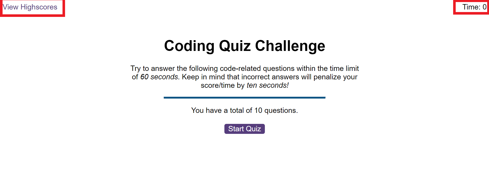
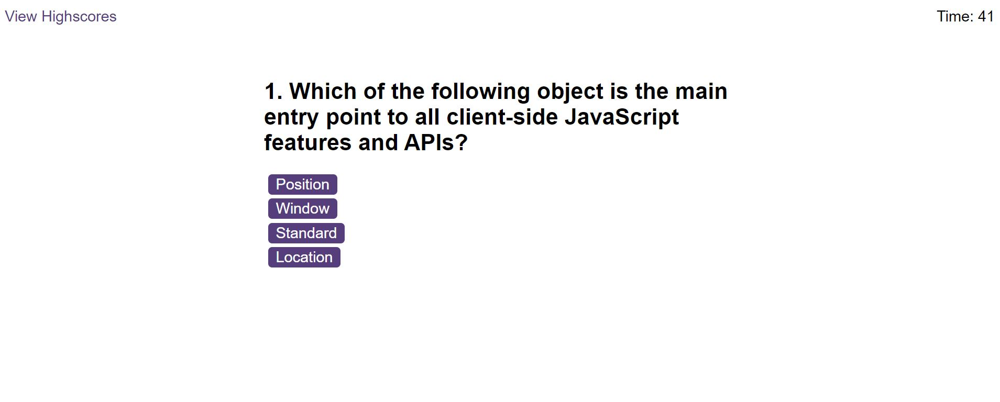
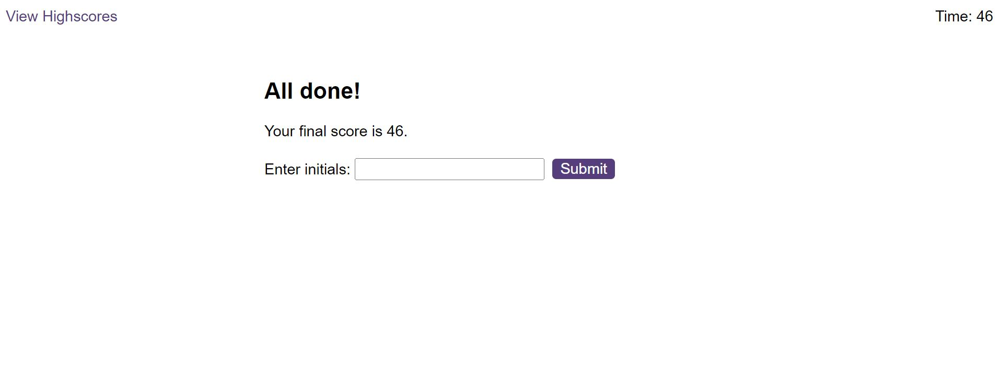

# timed-coding-quiz-App

## Description 
This quiz App is a browser app that renders timed multiple choice coding questions in JS, bult with JavaScript, HTML and CSS. At the time of initial build, there are 10 multiple choice questions to be answered within 60 seconds.

## App screen shot 

## Usage Instruction/Features
Follow the [App URL](). You will land on the home screen shown above. Click on the start quiz button to begin. Try to answer all questions correctly within the allotted time. Deduction of 10 seconds is triggered for each incorrect answers. Your final score is the total allotted time less the time spent in answering the questions. Find below an example question

At the end of the quiz, you have the option to save your Final score and your name or initials to your local storage as seen below

You could also clear your local storage by clicking the clear Highscores button indicated in red in the snapshot below. The Go back button takes you to the home screen. 

## Reflection 
This was a challenge project built during my 6th module at the University of Birmingahm FE web devopment bootcamp. 

Project goals included using my knowledge of web APIs, objects/data structures, and functions in JS together with HTML and CSS, learned up until this point in the bootcamp to build a dynamic web app.

The main challenge I ran into was checking the user's answer against the correct answer in my question bank's array of objects. This led me to spend a few hours researching, during which I learned a few more window objects, properties and methods that were not covered as part of the bootcamp lesson. 

At the end, the technology implmented in this project are JS, HTML and CSS. 

## Upcoming (New) Features
I plan to include the following features to extend the functonality and UI/UX of this web App

1. Colour to enhance the UI
2. A feature that allows users to log questions into the App and render if desired. On a simplistic scale, this feature will be useful for test providers. 

